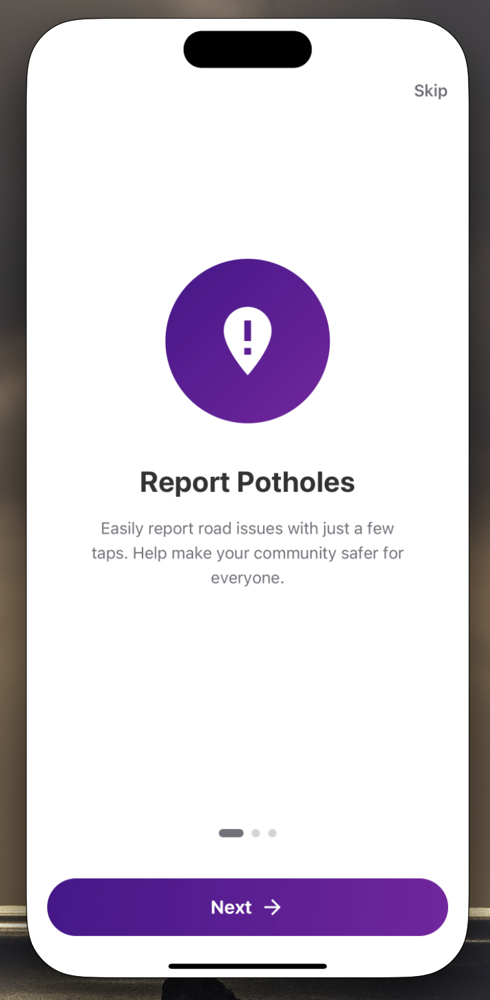
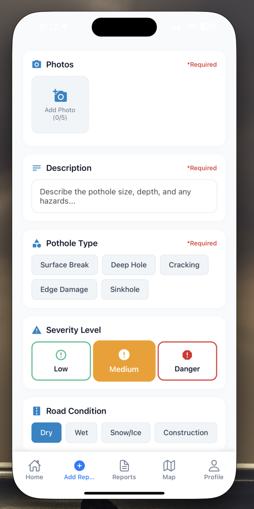
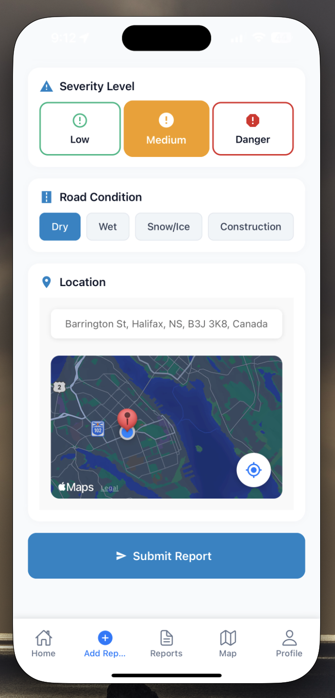
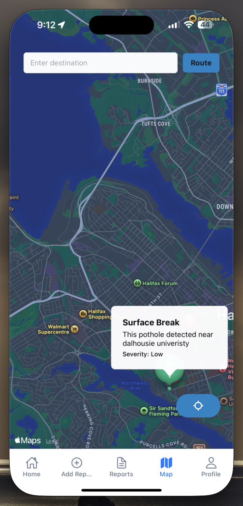
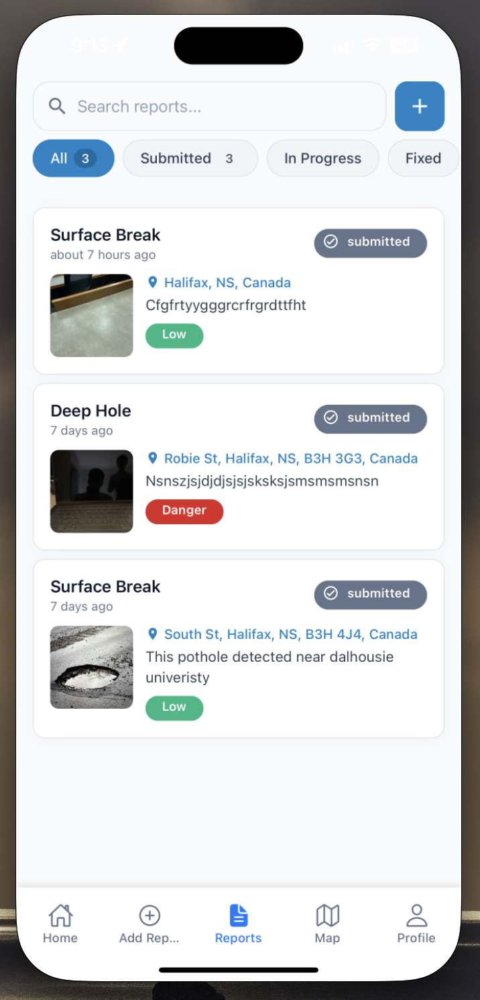
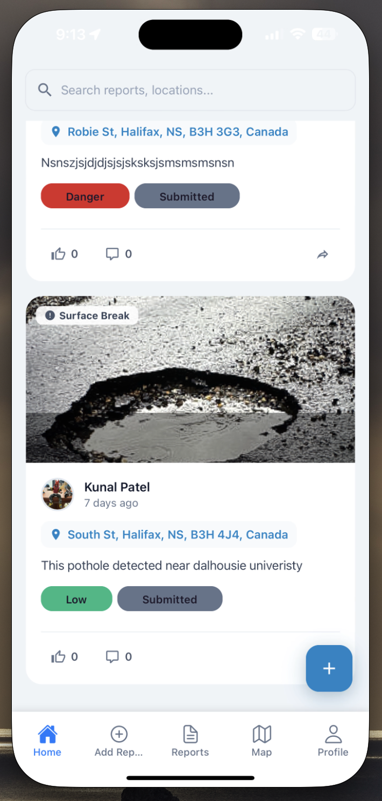

# Pothole Mobile App

## 📌 Project Overview

The **Pothole Mobile App** is a smart, AI-driven pothole detection and reporting platform built using **React Native**. The app allows users to detect potholes using **Machine Learning (ML)** models, report them, and track their status using **Supabase** for backend storage and authentication. Users can also browse reports on an interactive map and filter them based on severity levels.

## 🚀 Features

### 🔍 AI-Powered Pothole Detection

- Uses a **Machine Learning (ML) model** to automatically detect potholes in uploaded images.
- Classifies potholes based on severity levels (**Low, Medium, Dangerous**).
- Filters and prioritizes reports based on ML predictions.

### 📸 Report Potholes

- Users can capture or upload images of potholes.
- Provides options to add descriptions, severity levels, and road conditions.
- Automatically captures the location using **GPS** and **Google Maps API**.

### 🗺️ View Reports on an Interactive Map

- Displays reported potholes on a **live map**.
- Allows filtering reports based on severity, status (**Submitted, In Progress, Fixed**), and date.
- Provides navigation support to guide users to reported potholes.

### 🔐 User Authentication & Profile Management

- Secure **Sign Up / Login** using **Supabase Auth**.
- **Google OAuth** integration for quick access.
- Users can edit their profile information and view past reports.

### 📊 Track & Filter Pothole Reports

- View a **list of all reports**, sorted by location and severity.
- Filter reports by categories such as **Surface Break, Deep Hole, Edge Damage, Sinkhole, Cracking**.
- Comment, like, or share reports within the community.

### 🔄 Offline Support

- **AsyncStorage** support for caching reports.
- Users can submit pothole reports offline, which get uploaded once they are back online.

---

## 🛠 Technologies Used

- **React Native** – Cross-platform mobile development.
- **Expo** – Streamlined development & deployment.
- **TypeScript** – Type-safe coding.
- **Supabase** – Authentication & database backend.
- **React Navigation** – Manages in-app navigation.
- **React Query** – Efficient API data fetching and caching.
- **Tailwind CSS** – For sleek UI styling.
- **TensorFlow.js / ONNX** – ML integration for pothole detection.
- **Google Maps API** – Location tracking and map features.

## 🛠 Installation & Setup

### 1️⃣ Clone the Repository

```sh
git clone https://github.com/your-repo-url/PotholeMobileApp.git
cd PotholeMobileApp
```

### 2️⃣ Install Dependencies

```sh
npm install  # or yarn install
```

### 3️⃣ Setup Environment Variables

Create a `.env` file and configure the necessary environment variables:

```sh
SUPABASE_URL=your-supabase-url
SUPABASE_ANON_KEY=your-anon-key
ML_MODEL_API=your-ml-endpoint
MAPS_API_KEY=your-google-maps-api-key
```

### 4️⃣ Run the Application

#### For Android:

```sh
npx react-native run-android
```

#### For iOS (Mac Only):

```sh
npx pod-install
npx react-native run-ios
```

---

## 📂 Project Structure

```
PotholeMobileApp/
│── app/
│   ├── (screens)/
│   │   ├── (onboarding)/
│   │   │   ├── get-started.tsx
│   │   ├── (auth)/
│   │   │   ├── login.tsx
│   │   │   ├── register.tsx
│   │   │   ├── _layout.tsx
│   │   ├── (report)/
│   │   │   ├── report-issue.tsx
│   │   │   ├── report-list.tsx
│   │   │   ├── pothole-detection.tsx
│   │   │   ├── map-view.tsx
│   ├── components/
│   │   ├── auth-components/
│   │   │   ├── auth-container.tsx
│   │   │   ├── google-button.tsx
│   │   │   ├── auth-form.tsx
│   │   ├── ui/
│   │   │   ├── button.tsx
│   │   │   ├── input.tsx
│   ├── services/
│   │   ├── supabase-auth.ts
│   │   ├── supabase-reports.ts
│   │   ├── ml-model.ts (ML Integration)
│── package.json
│── tsconfig.json
│── babel.config.js
│── .env
│── images/
```

## 📱 Screenshots

<details>
  <summary>Click to Expand</summary>

### Onboarding



### Authentication

 

### Pothole Detection & Reporting

  

### Profile Management


### Map & Tracking

 

</details>

## 📦 Dependencies

```json
{
  "react-native": "latest",
  "expo": "latest",
  "@supabase/supabase-js": "latest",
  "react-navigation": "latest",
  "react-query": "latest",
  "tailwindcss": "latest",
  "@tensorflow/tfjs": "latest", // ML Integration
  "@react-native-maps/maps": "latest"
}
```

## 🔗 Contributing

Feel free to fork and submit pull requests. Open issues for bug reports and feature requests.

## 📜 License

MIT License. Free to use and modify.
